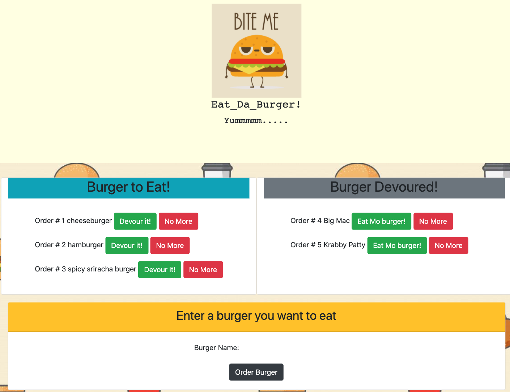

  # Project Title: 13_MVC_Eat_Da_Burger :raised_hands:
  - A burger logger with MySQL, Node, Express, Handlebars and a homemade ORM (yum!). Be sure to follow the MVC design pattern; use Node and MySQL to query and route data in your app, and Handlebars to generate your HTML.:bulb:
  - Eat-Da-Burger! is a restaurant app that lets users input the names of burgers they'd like to eat. 

  ### Heroku Link
  [](https://mvc-13-eat-da-burger.herokuapp.com)

  ## Table of Contents:
  - [User Story](#user-story-speech_balloon)
  - [Installation](#installation-floppy_disk)
  - [NPM Packages](#npm-packages)
  - [Contribution](#contribution-handshake)
  - [Author](#author-bust_in_silhouette)
    - [Name](#author-bust_in_silhouette)
    - [GitHub](#author-bust_in_silhouette)
    - [Heroku](#author-bust_in_silhouette)
  - [License](#license-trophy)

---
  ### User Story :speech_balloon:
  ```
   Whenever a user submits a burger's name, 
   your app will display the burger on the left side of the page -- waiting to be devoured.
   Each burger in the waiting area also has a Devour it! button. When the user clicks it, 
   the burger will move to the right side of the page.
   Your app will store every burger in a database, whether devoured or not.
   ```
  ---
  ###  Installation :floppy_disk::
 1. Clone this repository.
    ```
    git clone git@github.com:choumrdh/
    13_MVC_Eat_Da_Burger.git
    ```
1. Navigate into the cloned directory.
    ```
    cd 13_MVC_Eat_Da_Burger
    ```
1. Install Nodejs dependencies.
    ```
    npm install
    ```
1. In the root directory of the project, start the server.
    ```
    node server.js
    ```
1. In your browser navigate to the following page.
    ```
    http://localhost:8080
---
 ### NPM Packages
| Package | Documentation |
| ----------- | ----------- |
| `body-parser` | [Body-parser](https://www.npmjs.com/package/body-parser) |
| `express` | [Express](https://www.npmjs.com/package/express) |
| `express-handlebars` | [Express-handlebars](https://www.npmjs.com/package/express-handlebars) |
| `mysql`| [Mysql](https://www.npmjs.com/package/mysql)|
---
 ### Contribution :handshake: 
 
 [](https://github.com/choumrdh/13_MVC_Eat_Da_Burger/issues)
  
---
#### 	Author :bust_in_silhouette:
   - Name: Michelle [](https://github.com/choumrdh?tab=followers)
  
  > - GitHub: [choumrdh](https://github.com/choumrdh)
  > - Heroku: [Eat-Da-Burger](https://mvc-13-eat-da-burger.herokuapp.com)
---
### License :trophy:
   - [](https://github.com/choumrdh)